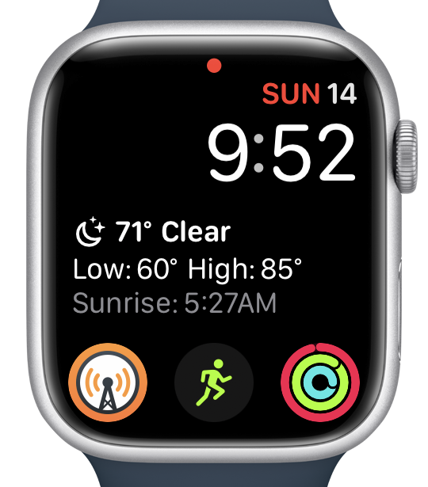
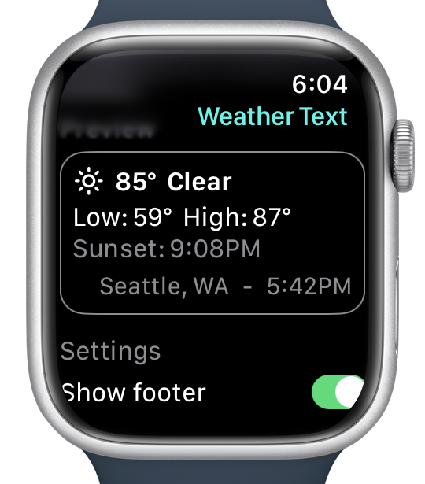

# Weather Text

watchOS app that displays a textual summary of the day's weather in a complication or widget. Meant to be a replacement for the Dark Sky's large watchOS complication (which stopped working in [late 2022](https://web.archive.org/web/20240521195120/https://blog.darksky.net/dark-sky-has-a-new-home/)).

|  |  |
| - | - |

## Installation

Weather Text is [available via TestFlight](https://testflight.apple.com/join/VOrTFGeM). It requires watchOS 10.0 or later. Installation happens on your iPhone, but the installed app is visible on a paired Apple Watch.

It is not available on the App Store because it uses the WeatherKit API, which has a limited number of free requests per day.

## Usage

The widget will update hourly and display the current location's conditions, highs and lows of the day, and the next sunset or sunrise time. An optional footer can be shown with the location name and update time (most useful when debugging).
