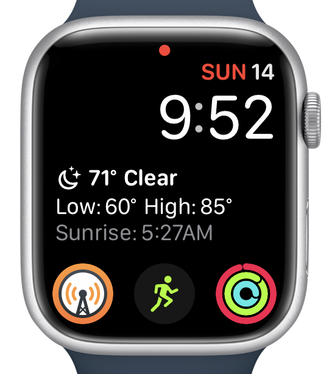
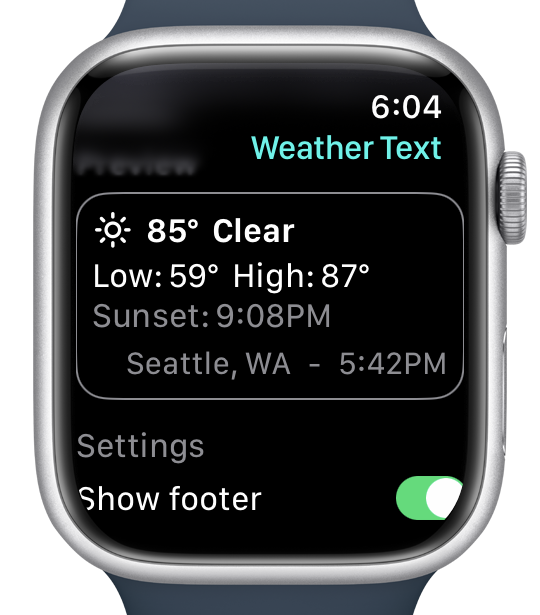

# Weather Text

Weather Text is a watchOS app that displays a textual summary of the day's weather in a complication or widget. It's meant to be a replacement for the Dark Sky's large watchOS complication (which stopped working in [late 2022](https://web.archive.org/web/20240521195120/https://blog.darksky.net/dark-sky-has-a-new-home/)). For information, see [this blog post](https://blog.persistent.info/2024/08/weather-text.html).

|  |  |
| - | - |

## Installation

Weather Text is available [via the App Store](https://apps.apple.com/app/weather-text/id6532596655). It requires watchOS 10.0 or later.

Development builds are also  [available via TestFlight](https://testflight.apple.com/join/VOrTFGeM). TestFlight  installation happens on your iPhone, but the installed app is visible on a paired Apple Watch.

## Usage

The widget will update hourly and display the current location's conditions, highs and lows of the day, and the next sunset or sunrise time. An optional footer can be shown with the location name and update time (most useful when debugging).

You can also specify a "work location" in the app, which optionally shows the weather for that location on workday mornings, if it has materially different conditions than your current location.
